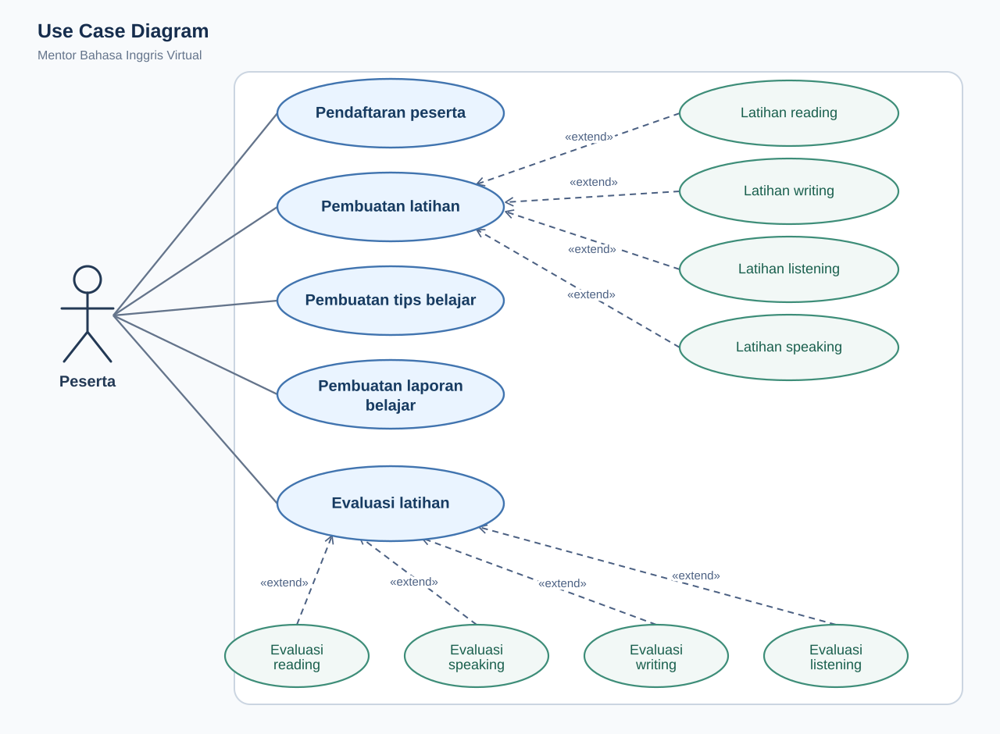
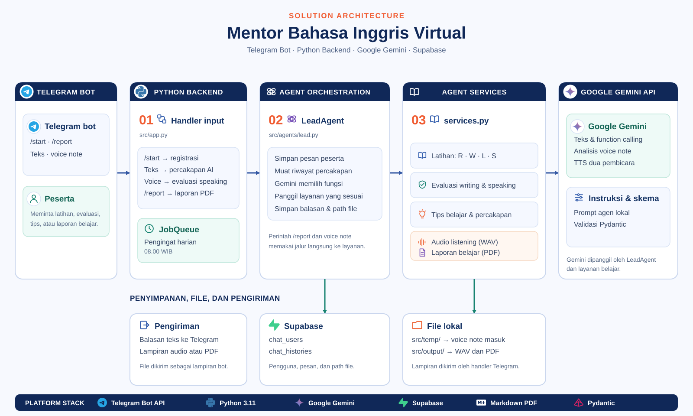

# Mentor Bahasa Inggris Virtual

Bot Telegram berbasis AI untuk belajar bahasa Inggris melalui percakapan, latihan, dan evaluasi. Project ini menggunakan Google Gemini untuk memproses pesan dan audio, serta Supabase untuk menyimpan pengguna dan riwayat belajar.

## Fitur

- **Latihan empat keterampilan:** reading, writing, listening, dan speaking sesuai permintaan pengguna.
- **Evaluasi writing:** koreksi grammar dan penulisan dari teks yang dikirim.
- **Evaluasi speaking:** umpan balik dari voice note Telegram.
- **Audio listening:** percakapan dua pembicara dalam format WAV beserta pertanyaan latihan.
- **Riwayat percakapan:** tersimpan di Supabase dan digunakan sebagai konteks balasan.
- **Laporan belajar PDF:** dibuat lewat perintah `/report`.
- **Pengingat harian:** dikirim pukul **08.00 WIB** selama aplikasi berjalan.
- **Tips belajar** dan mode percakapan melalui terminal (CLI).

## Teknologi

| Komponen | Teknologi |
| --- | --- |
| Bahasa | Python 3.11 atau lebih baru |
| AI dan text-to-speech | Google Gemini melalui `google-genai` |
| Bot | `python-telegram-bot` dengan JobQueue |
| Database | Supabase |
| Validasi respons AI | Pydantic |
| Pembuatan laporan | `markdown-pdf` |
| Konfigurasi dan logging | `python-dotenv`, Loguru |
| Pengelolaan dependency | uv |

## Persiapan

Siapkan Python 3.11+, uv, koneksi internet, serta:

1. API key Gemini dan akses ke model untuk teks, pemrosesan audio, dan text-to-speech dua pembicara.
2. Project Supabase beserta URL dan key untuk backend.
3. Token bot Telegram dari **@BotFather**.

### 1. Instal dependency

Jalankan dari direktori utama project:

```bash
uv sync --locked
```

### 2. Atur environment variable

Buat file `.env` di direktori yang sama dengan `main.py`, lalu isi:

```dotenv
GEMINI_API_KEY=isi_api_key_gemini
GEMINI_MODEL=isi_id_model_gemini_teks_dan_audio
GEMINI_MODEL_TTS=isi_id_model_gemini_tts
SUPABASE_URL=https://PROJECT_ID.supabase.co
SUPABASE_KEY=isi_key_backend_supabase
TELEGRAM_BOT_TOKEN=isi_token_bot_telegram
```

Ganti seluruh placeholder dengan konfigurasi milikmu. `GEMINI_MODEL` harus mendukung function calling dan input audio; `GEMINI_MODEL_TTS` harus mendukung keluaran audio dengan dua pembicara. Nama model dibaca dari `.env`, bukan ditetapkan di kode.

Semua variabel di atas wajib terisi, termasuk saat memakai CLI. Jangan commit `.env` atau membagikan key. `.gitignore` saat ini belum mengecualikan `.env`; tambahkan entri `.env` sebelum melakukan commit konfigurasi lokal.

### 3. Siapkan tabel Supabase

Repository belum menyediakan migrasi database. Berikut contoh skema minimal berdasarkan kolom yang dipakai oleh `ChatRepository`. Jalankan di SQL Editor untuk project Supabase baru:

```sql
create table public.chat_users (
    user_id bigint primary key,
    username text not null,
    chat_id bigint not null
);

create table public.chat_histories (
    id bigint generated by default as identity primary key,
    user_id bigint not null,
    role text not null check (role in ('user', 'model')),
    message_text text not null,
    artifact_path text,
    created_at timestamptz not null default now()
);

create index chat_histories_user_created_at_idx
    on public.chat_histories (user_id, created_at);

alter table public.chat_users enable row level security;
alter table public.chat_histories enable row level security;
```

Contoh ini memakai RLS tanpa policy akses publik. Gunakan key backend Supabase yang dapat melewati RLS, misalnya `service_role`, hanya di environment server/lokal yang menjalankan bot. Aplikasi tidak memiliki alur login Supabase untuk pengguna Telegram.

## Menjalankan bot

```bash
uv run python main.py
```

Bot menerima pesan melalui **polling**, sehingga tidak membutuhkan konfigurasi webhook. Biarkan proses tetap berjalan agar bot menerima pesan dan mengirim pengingat.

Buka percakapan pribadi dengan bot di Telegram, lalu kirim `/start` untuk mendaftarkan pengguna.

| Perintah atau input | Kegunaan |
| --- | --- |
| `/start` | Mendaftarkan pengguna dan menampilkan panduan |
| `/report` | Membuat dan mengirim laporan belajar PDF |
| `Buatkan soal reading untuk pemula` | Meminta latihan reading |
| `Buatkan latihan writing tentang kegiatan sehari-hari` | Meminta latihan writing |
| `Buatkan latihan listening tentang memesan makanan` | Meminta audio dan pertanyaan listening |
| `Buatkan latihan speaking untuk perkenalan diri` | Meminta latihan speaking |
| `Periksa: I goes to school` | Meminta koreksi tulisan |
| `Kasih tips belajar` | Mendapatkan tips belajar |
| Voice note berbahasa Inggris | Meminta evaluasi speaking |

### Mode CLI

Untuk mencoba percakapan lewat terminal:

```bash
uv run python -c "from src.app_cli import run; run()"
```

Ketik `/exit` untuk keluar. Mode ini menggunakan `user_id=101010`, tetap membutuhkan Gemini dan Supabase, serta hanya menampilkan teks respons. File hasil generasi tidak dikirim seperti pada Telegram.

## Use case diagram



Diagram ini menunjukkan interaksi Peserta dengan pendaftaran, pembuatan latihan, tips belajar, laporan belajar, dan evaluasi latihan. Empat jenis latihan dan empat jenis evaluasi memperluas use case utamanya.

## Solution architecture



Telegram dan CLI meneruskan permintaan ke handler dan `LeadAgent`. Orkestrator memuat riwayat dari Supabase, menggunakan Gemini untuk memilih fungsi, lalu menjalankan layanan latihan, evaluasi, tips, audio, atau laporan. Bot mengirim balasan dan lampiran; JobQueue mengirim pengingat harian pukul 08.00 WIB.

## Alur aplikasi

1. Pesan Telegram diterima oleh handler di `src/app.py`.
2. `LeadAgent` menyimpan pesan dan mengambil riwayat percakapan pengguna dari Supabase.
3. Gemini memilih fungsi yang sesuai, seperti membuat latihan, mengevaluasi tulisan, atau memberikan tips.
4. Respons disimpan ke database, lalu dikirim ke pengguna beserta file hasil generasi jika tersedia.

Voice note diproses melalui evaluasi speaking. Perintah `/report` mengambil riwayat percakapan, menyusun laporan dengan Gemini, lalu mengubahnya menjadi PDF.

## Struktur project

```text
.
├── main.py                       # Entry point bot Telegram
├── pyproject.toml                # Metadata dan dependency
├── uv.lock                       # Versi dependency yang dikunci
└── src/
    ├── app.py                    # Handler Telegram dan pengingat harian
    ├── app_cli.py                # Percakapan lewat terminal
    ├── agents/
    │   ├── lead.py               # Orkestrasi percakapan dan pemanggilan fungsi
    │   ├── services.py           # Latihan, evaluasi, audio, dan laporan
    │   └── Instructions/         # Instruksi masing-masing agen
    ├── core/
    │   ├── env.py                # Environment variable dan direktori
    │   ├── llm.py                # Client Gemini dan retry
    │   ├── supabase.py           # Client Supabase
    │   ├── schemas.py            # Skema respons terstruktur
    │   ├── prompts.py            # Pembacaan instruksi agen
    │   ├── artifacts.py          # Pengumpulan file hasil generasi
    │   └── format.py             # Format Markdown Telegram
    ├── repository/
    │   └── chat_repository.py    # Akses data pengguna dan percakapan
    └── output/                   # Audio dan PDF hasil generasi
```

Direktori `src/temp/` dibuat saat menerima voice note. File voice note lokal dihapus setelah pemrosesan berhasil; lampiran yang dikirim melalui `_send_artifact` juga dihapus setelah berhasil dikirim.

## Catatan implementasi

- `/report` memberikan rentang tanggal tujuh hari terakhir kepada model, tetapi pengambilan riwayat dari database **belum difilter berdasarkan tanggal**. Laporan masih dapat mempertimbangkan percakapan di luar rentang tersebut.
- Pengingat menggunakan ID pengguna sebagai tujuan pesan. Gunakan bot melalui percakapan pribadi.
- Pada sistem yang membedakan huruf besar dan kecil, samakan nama folder `src/agents/Instructions/` dengan path `instructions` di `src/core/env.py` agar instruksi dapat dibaca.
- Jalankan bot melalui `uv run python main.py`. Entry point paket `mentor-bahasa-inggris-virtual` saat ini masih menjalankan fungsi placeholder di `src/__init__.py`.

## Kendala umum

| Kendala | Yang perlu diperiksa |
| --- | --- |
| `Environment variable '...' belum diatur` | Pastikan keenam variabel di `.env` terisi dan jalankan dari direktori utama project |
| Tabel tidak ditemukan atau akses Supabase ditolak | Periksa skema tabel, URL project, key backend, dan pengaturan RLS |
| Instruksi agen tidak ditemukan | Periksa kapitalisasi folder `Instructions` dan path di `env.py` |
| Audio listening gagal dibuat | Periksa akses model TTS, dukungan dua pembicara, dan kuota Gemini |
| `ZoneInfoNotFoundError` untuk `Asia/Jakarta` | Instal data zona waktu dengan `uv pip install tzdata` pada environment yang digunakan |
| Pengingat tidak terkirim | Pastikan pengguna sudah mengirim `/start` di chat pribadi dan bot aktif pukul 08.00 WIB |
